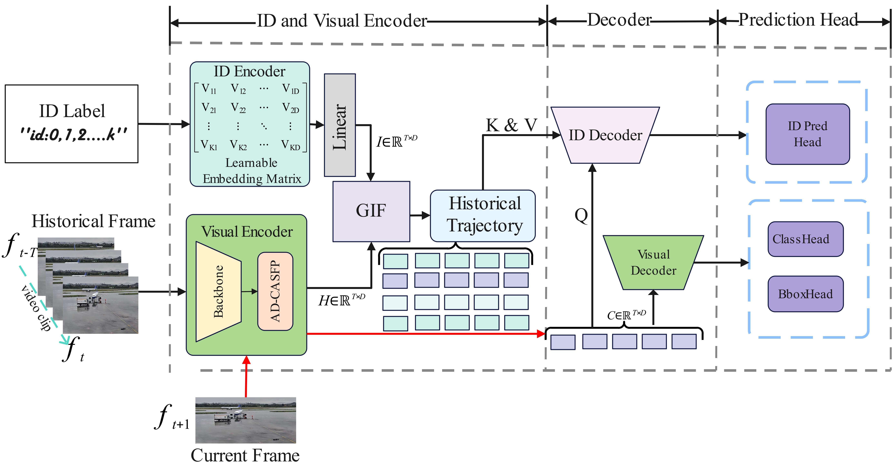

<div align="center">
<h1> 🦖ETETMO </h1>
<h3>ETETMO: An End-to-End Visual Intelligent Surveillance Framework for Robust Tracking of Moving Objects on the Airport Surface</h3>
[XIANGQING DONG](https://orcid.org/0009-0004-3789-4359)<sup>1</sup>,[MENG DING](https://faculty.nuaa.edu.cn/dm/zh_CN/index.htm)<sup>:email:</sup><sup>1</sup>,[YUBIN XU]<sup>2</sup>, [YIMING XU]<sup>1</sup>, [LI CAO]<sup>1</sup> 

<sup>1</sup> Nanjing University of Aeronautics and Astronautics, <sup>2</sup>Chinese Academy of Civil Aviation Science and Technology
  
<sup>:email:</sup> corresponding author.
</div>

## :fire: Updates

- **`2/07/2025`**: We release the pre-trained models and the detect code.

- **`1/07/2025`**: We have published some visualization experiments static and dynamic results.

- **`11/02/2024`**: We submitted the paper. Code and pre-trained model are coming soon.

## :rocket: Introduction
This project contains the official PyTorch implementation, pre-trained models, fine-tuning code, and detect demo for ETETMO.

* An end-to-end intelligent visual surveillance framework,ETETMO, is proposed for robust tracking of moving objects on the airport surface.

* ETETMO replaces the traditional manually designed ID association methods with a learnable ID classification strategy.

* ETETMO surpasses state-of-the-art methods across five key evaluation metrics, achieving a 7.6% improvement in HOTA and an 11% improvement in IDF1.

## :page_facing_up: Overview



## :sparkles: Model Zoo
* [Weight CKPT](https://huggingface.co/lingxiaodu/model/blob/main/rtdetr-r34.pt) 
## :checkered_flag: Getting Started
### 1. DATASET Structure
```
ETETMO
├── dataset
│   ├── ASV-T2024
│   │   ├── annotations
│   │   ├── train
│   │   ├── val
│   │   └── test
│   ├── coco
│   │   ├── annotations
│   │   ├── train2017
│   │   └── val2017
```
### 2. Installation
```
Compile and install the required packages
pip install timm==0.9.8 thop efficientnet_pytorch==0.7.1 einops grad-cam==1.4.8 dill==0.3.6 albumentations==1.3.1 pytorch_wavelets==1.3.0 tidecv PyWavelets -i https://pypi.tuna.tsinghua.edu.cn/simple
    pip install -U openmim
    mim install mmengine
    mim install "mmcv>=2.0.0"
```
## :computer: Visualization of experimental results


## :🎥 Video Demonstration

The following video demonstrates the dynamic performance of our proposed method under real-world conditions. It showcases the robustness and generalization of the model in handling various scenarios.

<video src="result/MyVideo_1.mp4" width="800" controls></video>

> 📌 If the video does not play properly in your browser, you can [download it here](result/MyVideo_1.mp4) or watch it via an external player.

## :blush: Acknowledge
This project has referenced some excellent open-sourced repos ([Detectron2](https://github.com/facebookresearch/detectron2), [detrex](https://github.com/IDEA-Research/detrex), [RT-DETR](https://github.com/lyuwenyu/RT-DETR), [ultralytics](https://github.com/ultralytics/ultralytics)). Thanks for their wonderful works and contributions to the community.

